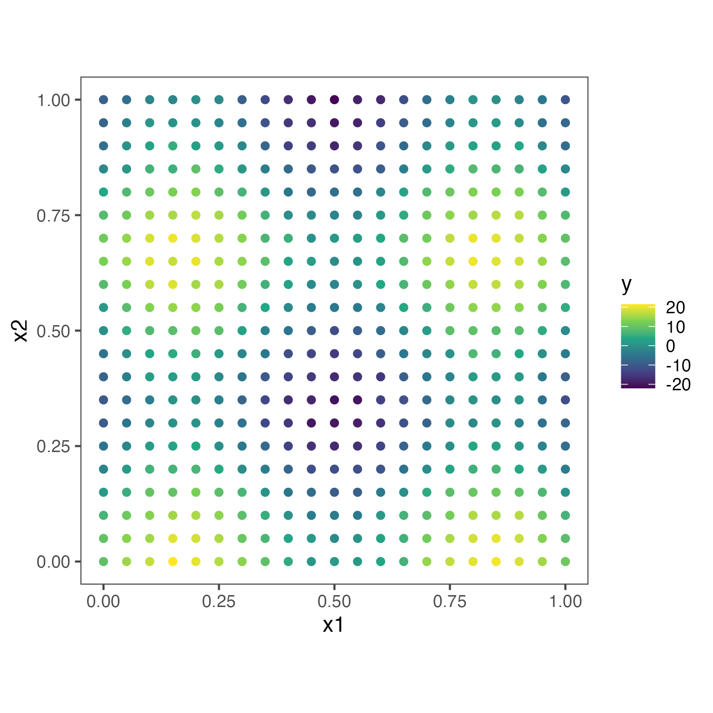
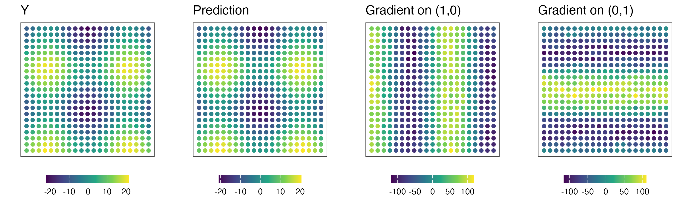
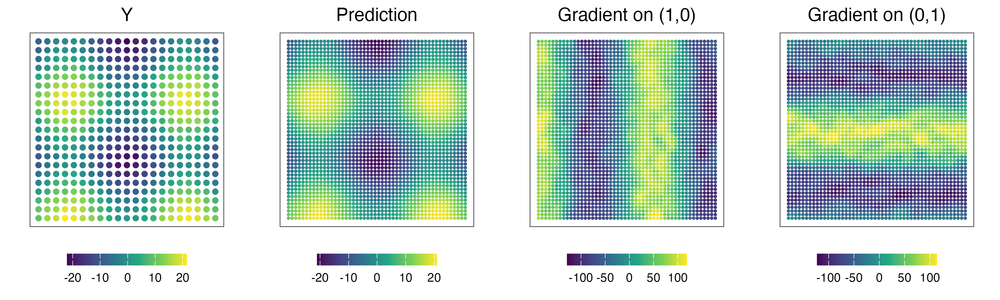

This tutorial holds the example analysis to estimate gradients for simulation data (Simulation1 in the [paper](https://www.biorxiv.org/content/10.1101/2024.05.08.593025.abstract)). 

#### 1. Simulate data

For simulation1, we simulate $$y \sim 10 N(sin(3\pi x_1)+cos(3\pi x_2),1)$$ .


```r
library(dplyr)
library(data.table)
library(ggplot2)
library(cowplot)
library(ggsci)
library(egg)
library(paletteer)

rmvn <- function(n, mu=0, V = matrix(1)){
    p <- length(mu)
    if(any(is.na(match(dim(V),p))))
    stop("Dimension problem!")
    D <- chol(V)
    t(matrix(rnorm(n*p), ncol=p)%*%D + rep(mu,rep(n,p)))
}

##Make some data
set.seed(1)
N <- 100
tau <- 1
# synthetic location
#coords <- matrix(runif(2*N),nr=N,nc=2) 

coords_x = seq(0,1,0.05)
coords_y = seq(0,1,0.05)
coords = expand.grid(coords_x,coords_y) %>% as.matrix()

# synthetic pattern 
y <- rnorm(nrow(coords),10*(sin(3*pi*coords[,1])+cos(3*pi*coords[,2])),tau)
```
<p align="center">

</p>

#### 2. Fit Nearest-Neighbor Gaussian Process (NNGP) model

```r
library(StarTrail)
thread = 1 # number of CPUs to use
m.r = fit_NNGP(coords,y,neighbor = 10,threads = thread) # here we use 10 neighbors
```

#### 3. Calculate gradients

```r
# minimal separation of training data coordiantes
min_sep = 0.05 

# gradient at the orignial resolution
gradient_all = finite_difference(coords, # coordinate of the point you wanna calculate the gradient on e1 and e2
                                 min_sep*0.8, # h: minimal separation
                                 m.r, # fitted NNGP model
                                 threads=thread, # cpu to use
                                 prefix = 'ori', # file prefix of saved file
                                 path=path,# path to save files
                                 save_file = FALSE,
                                 verbose = FALSE # print progress
                                 ) 
gradient_all = cbind(coords,y,gradient_all)
colnames(gradient_all) = c('s1','s2','y','pred','g1','g2','g1_min','g1_max','g2_min','g2_max')
# s1: first item of coord (x1), s2: first item of coord (x2)
# y: truth, pred: predicted y
# g1: gradient on (1,0), g2: gradient on (0,1)
# g1_min, g1_max, g2_min, g2_max: posterior min and max for g1 and g2
```

Here are the estimated gradients.
<p align="center">

</p>


#### 4. Increase resolution

```r
# coordinates at the increased resolutionå
coord_mesh_x = seq(min(coords[,1]),max(coords[,1]),length.out=50)
coord_mesh_y = seq(min(coords[,2]),max(coords[,2]),length.out=50)
coord_mesh = expand.grid(coord_mesh_x,coord_mesh_y) %>% as.matrix()

gradient_mesh = finite_difference(coord_mesh,min_sep*0.8,m.r,threads=thread,prefix = 'mesh',path=path,verbose = FALSE)
gradient_mesh = cbind(coord_mesh,gradient_mesh)
colnames(gradient_mesh) = c('s1','s2','pred','g1','g2','g1_min','g1_max','g2_min','g2_max')
```

<p align="center">

</p>