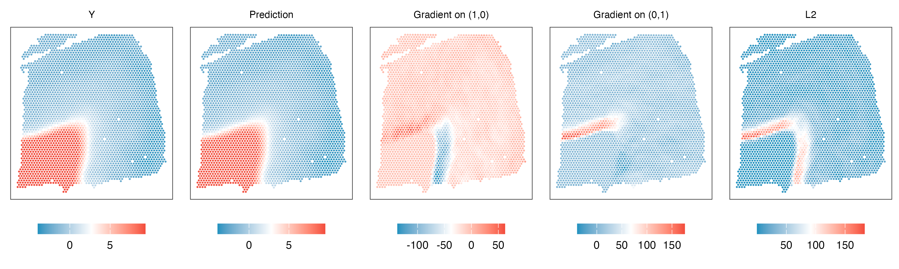
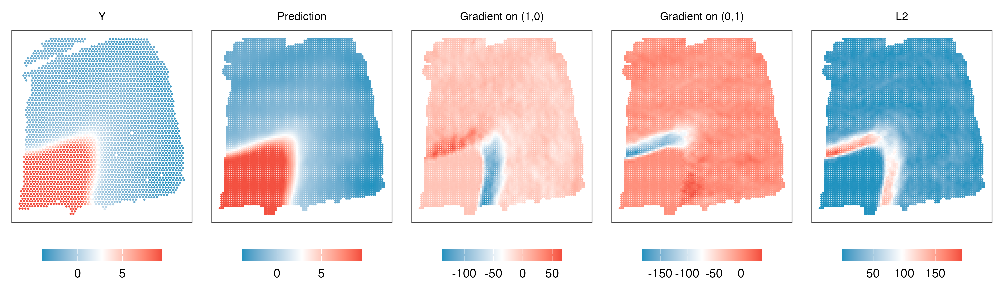

This tutorial holds the example analysis to estimate gradients for human dorsolateral prefrontal cortex (DLPFC) data ([Maynard et. al. (2021) ](https://www.nature.com/articles/s41593-020-00787-0), slide 151676). All data used in this example could be downloaded from [here](https://drive.google.com/drive/folders/1yWfWj8m7QLnWHd4CSbEo72mplw07QF-x?usp=sharing).

#### 1. Load gene expression data

Here we smoothed and normalized the gene expression.

``` r
# set up environment
library(dplyr)
library(data.table)
library(ggplot2)
library(cowplot)
library(ggsci)
library(egg)
library(paletteer)

gene_exp = fread(paste0('151676_smooth_r500_norm.txt'))
gene_exp = na.omit(gene_exp) %>% as.data.frame(check.names=F)
gene_exp = gene_exp %>% filter(layer != '')

# We recommend to min-max the coordinates
coords = gene_exp[,c('x','y')] %>% as.matrix()
coords = coords-min(coords)
coords = coords/max(coords)
```

#### 2. Fit NNGP model

We use ***MBP*** as an example.

```r
gene_name='MBP'
thread = 1
y = gene_exp[,gene_name]
m.r = fit_NNGP(coords,y,10,thread) # use 10 neighbor, 1 thread
saveRDS(m.r,'model.rds') # save for future use
```

#### 3. Estimate gradients
``` r
# calculate minimal distance between data points, only use this when data is in grid/hexagon
# For data like Slide-seqV2, please manual set this min_sep
coord_dist = cdist_r(coords,coords)
coord_dist_temp  = coord_dist
diag(coord_dist_temp)=10000
min_sep = min(coord_dist_temp)

gradient_all = finite_difference(coords,min_sep*0.8,m.r,threads=thread,prefix = 'ori',path=path)
gradient_all = cbind(coords,y,gradient_all)
colnames(gradient_all)[1:3] = c('s1','s2','y')
```

<p align="center">

</p>

#### 3. Estimate gradients at enhanced resolution

``` r
# Enhance resolution of the points
coord_mesh_x = seq(min(coords[,1]),max(coords[,1]),length.out=100)
coord_mesh_y = seq(min(coords[,2]),max(coords[,2]),length.out=100)
coord_mesh = expand.grid(coord_mesh_x,coord_mesh_y) %>% as.matrix()

# only keep points within the range of original resolution
index_keep = coord_filter(coord_mesh, coords, close_dis = min_sep, distance_to_boundary = min_sep*2)
coord_mesh=coord_mesh[index_keep,]

gradient_mesh = finite_difference(coord_mesh,min_sep*0.8,m.r,threads=thread,prefix = 'mesh',path=path)
gradient_mesh = cbind(coord_mesh,gradient_mesh)
colnames(gradient_mesh)[1:2] = c('s1','s2')

fwrite(gradient_mesh,'MBP_gradient_mesh.txt',col.names=TRUE,sep='\t)
```
<p align="center">

</p>