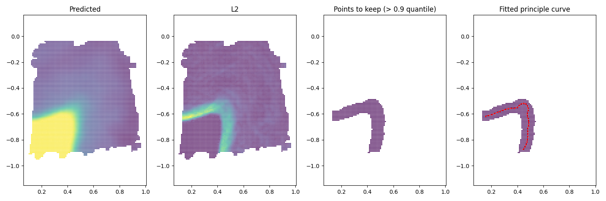
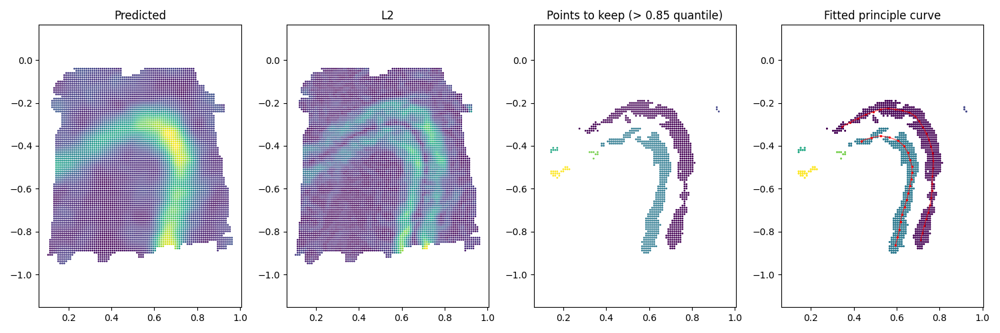

Here we showcase how to find gene expression boundary on human DLPFC data (gene ***MBP*** and ***PCP4***). We note here that this pipeline is written in python. The required input is the estimated gradients for each gene (e.g. MBP_gradient_mesh.txt from [previous tutorial](03_DLPFC_estimate)). We used principle curve to fit the boundary using [elpigraph](https://elpigraph-python.readthedocs.io/en/latest/) package. All data used in this example could be downloaded from [here](https://drive.google.com/drive/folders/1yWfWj8m7QLnWHd4CSbEo72mplw07QF-x?usp=sharing).


#### 1. Load packages

```python
from sklearn.datasets import make_blobs
from sklearn.preprocessing import StandardScaler
import matplotlib.pyplot as plt
import sys
import numpy as np
import pandas as pd
import torch
import os
from scipy.io import loadmat
from math import floor
import numpy as np
from sklearn import metrics
from sklearn.cluster import DBSCAN

import elpigraph
```

#### 2. Fit boundary for ***MBP***

We start with loading the estimated gradients. To fit the boundary, we first find spots with large L2-norm gradients. Here we use 0.9 quantile as the threshold. 

```python
# load estimated gradients
gradient_mesh = pd.read_csv("MBP_gradient_mesh.txt",sep='\t')
coord_mesh = gradient_mesh[['s1', 's2']].to_numpy()
pred = np.array(gradient_mesh['pred'])

# Find the spots with high gradients (L2)
L2 = np.array((gradient_mesh.g1**2+gradient_mesh.g2**2)**0.5)
index_keep = (L2 > np.quantile(L2, 0.9)) # use 0.9 quantile
coord_mesh_grad = coord_mesh[index_keep, :]
```

Then we use [DBSCAN](https://scikit-learn.org/stable/modules/generated/sklearn.cluster.DBSCAN.html) to find large cluster of the spots for better fitting. **Adjust the eps as needed.**

```python
db = DBSCAN(eps=0.01, min_samples=1).fit(coord_mesh_grad)
labels = db.labels_
labels_unique, counts = np.unique(labels, return_counts=True)

# only keep large clusters, here we use 200 spots as threshold. Adjust according to your resolution.
min_num_spot = 100
labels_to_keep = labels_unique[counts > min_num_spot]
```

Using the spots, we fit principle curve for each cluster of spots. The hyper-parameter here is the number of nodes on the curve, we used $$\frac{\text{ #spots in each cluster}}{50}$$. Adjust as needed.

```python
gene_boundary = []
for i in range(labels_to_keep.shape[0]):
    coord_final = coord_mesh_grad[labels==labels_to_keep[i],]
    coord_final[:,1] = -coord_final[:,1]

    PG = elpigraph.computeElasticPrincipalCurve(coord_final,
                                                # adjust as needed
                                                NumNodes=int(counts[counts > min_num_spot][i]/50))[0]
    nodesp = PG["NodePositions"]
    #np.savetxt(path+'/curve'+str(i)+'_NodePositions.txt',nodesp)
    Edges = PG["Edges"][0].T
    #np.savetxt(path+'/curve'+str(i)+'_Edges.txt',Edges)
    points_all = []
    for j in range(Edges.shape[1]):
        x_coo = np.concatenate(
            (nodesp[Edges[0, j], [0]], nodesp[Edges[1, j], [0]])
        )
        y_coo = np.concatenate(
            (nodesp[Edges[0, j], [1]], nodesp[Edges[1, j], [1]])
        )
        plt.plot(x_coo, y_coo, c="red", linewidth=1, alpha=0.6)
        points_all.append(np.concatenate((x_coo,y_coo),axis=0))

    # the fitted principle curve(points_all) output includes the segments, formatted in 4 columns: 'start_x','end_x','start_y','end_y'
    # if the line is a single curve (doesn't have branches), you can use format_principle_curve in StarTrail R package to format it into a line
    points_all = np.array(points_all)
    gene_boundary.append(gene_boundary)
    #np.savetxt(path+'/curve'+str(i)+'_points_all.txt',points_all)
```

<p align="center">

</p>


#### 2. Fit boundary for ***PCP4***

We can also find boundary for a more complicated expression gene (e.g. multiple boundaries). All you need to do is to adjust the hyper-parameters. Here we keep spots with L2 greater than $$0.85$$ quantile. We also set the **eps** slightly larger as $$0.03$$. 

```python
index_keep = (L2 > np.quantile(L2, 0.85)) # use 0.85 quantile
db = DBSCAN(eps=0.03, min_samples=1).fit(coord_mesh_grad)
```

Then we can fit boundary to each cluster of spots.

<p align="center">

</p>
