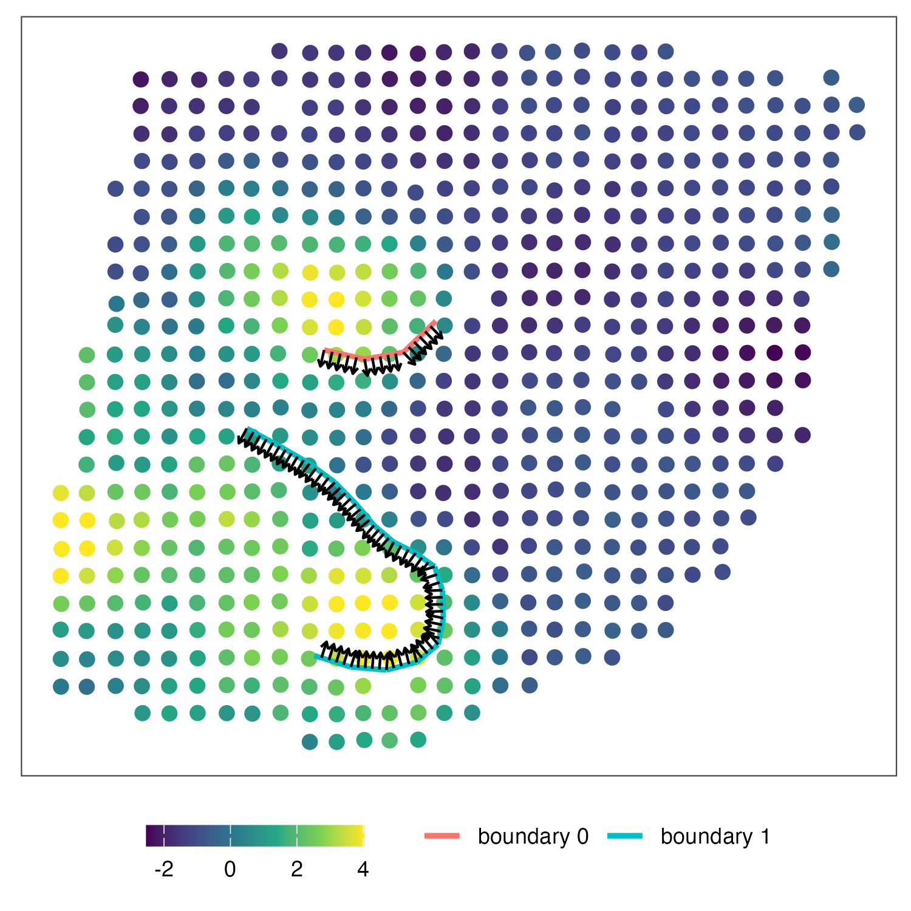

This tutorial holds the example analysis to perform wombling to estimate boundary gradients in HER2+ breast cancer data ([Andersson et al.](https://www.nature.com/articles/s41467-021-26271-2), slide H1). All data used in this example could be downloaded from [here](https://drive.google.com/drive/folders/1yWfWj8m7QLnWHd4CSbEo72mplw07QF-x?usp=sharing).


#### 1. Load gene expresssion and fitted NNGP model

Here we use ***ERBB2*** as an example. 

```r
library(dplyr)
library(data.table)
library(ggplot2)
library(cowplot)
library(ggsci)
library(egg)
library(paletteer)
library(StarTrail)

gene_exp = fread('data/her2+bc/H1_smooth_norm.txt')
gene_exp = na.omit(gene_exp) %>% as.data.frame(check.names=F)

gene_name = 'ERBB2'

# reformate the coordinate as the way when fitted the NNGP model
coords = gene_exp[,c('new_x','new_y')] %>% as.matrix()
min_coords = min(coords)
coords = coords-min(coords)
max_coords = max(coords)
coords = coords/max(coords)
# calculate minimal separation
coord_dist = cdist_r(coords,coords)
coord_dist_temp  = coord_dist
diag(coord_dist_temp)=10000
min_sep = min(coord_dist_temp)

# load fitted NNGP model
model = readRDS(paste0('data/her2+bc/',gene_name,'_model.rds'))

threads=1
h = 0.8*min_sep
```

#### 2. Load boundary and perform wombling
Here we use the boundaries of cancer epithelial cell proportion, which are the output from principle curve (in segment format, following the [previous tutorial](04_DLPFC_boundary) for fitting the boundary). You can also use matrix with 2 columns (x,y) as input. We will format the segment of the curve using each pair of contiguous points.

```r

boundary_all = list()
wombling_result_all = list()
wombling_result = c()
for(bound_num in 0:1){
  boundary = fread(paste0('data/her2+bc/cancer_epi_boundary/curve',bound_num,'_points_all.txt'))
  boundary = boundary %>% as.data.frame(check.names=F)
  # start from here for principle curve output
  colnames(boundary) = c('start_x','end_x','start_y','end_y')
  boundary$start_y = -boundary$start_y # we did these because we multiply -1 to the y coord when fit boundary
  boundary$end_y = -boundary$end_y
  boundary = format_principle_curve(boundary)
  # start from here for 2 column coordinate matrix
  boundary = refine_boundary(boundary,min_dis=0.01) # cut the boundary segment into smaller segments for better estimate
  boundary_all[[bound_num+1]] = data.table(boundary) # save the processed boundary coordinates
  wombling_result_all[[bound_num+1]]=wombling(model, # fitted NNGP model
                                              boundary, # boundary coord
                                              h,
                                              threads) %>% as.data.table()
  wombling_result = c(wombling_result,sum(wombling_result_all[[bound_num+1]]$g_simpson))
}
```

**wombling_result** stores the result for the gradients for each boundary. **wombling_result_all[[bound_num+1]]** stores the detailed gradients for each segment. After you calculate the gradients of each gene, you could rank the gene based on their boundary gradients. To combine multiple boundary, just add them up. Here we reverse the direction of boundary 0 by multiply $$-1$$.

```r
wombling_result[2]+ (-1) * wombling_result[1]
# in the paper we normalized the result by the total boundary length
(wombling_result[2] + (-1) * wombling_result[1])/(sum(wombling_result_all[[1]]$u_len)+sum(wombling_result_all[[2]]$u_len))
```

#### 4. (optional) Check wombling direction and visualization
You can combine the gradients of multiple boundaries. We recommend to check the direction of wombling before combination.

```r
# reformat (x,y) to ('start_x','end_x','start_y','end_y')
bc_bound0 = reformat_bound(boundary_all[[1]])
bc_bound1 = reformat_bound(boundary_all[[2]])

# calculate the normal direction of each segments
b0_dir = wombling_direction(boundary_all[[1]])
b1_dir = wombling_direction(boundary_all[[2]])

# visualize
k=ggplot()+geom_point(aes(x=coords[,1],y=coords[,2],fill=ERBB2),data=gene_exp,shape=21,size=3,color='white')+
  geom_segment(aes(x = x_start, y = y_start, xend = x_end, yend=y_end,color='boundary 0'),lwd=1,data=bc_bound0,show.legend=TRUE)+
  geom_segment(aes(x = x_start, y = y_start, xend = x_end, yend=y_end,color='boundary 1'),lwd=1,data=bc_bound1,show.legend=TRUE)+
  geom_segment(aes(x = start_x, y = start_y, xend = start_x+h*v1, yend=start_y+h*v2),lwd=0.5,data=b0_dir,show.legend=FALSE,arrow =arrow(length = unit(0.01, "npc")))+
  geom_segment(aes(x = start_x, y = start_y, xend = start_x+h*v1, yend=start_y+h*v2),lwd=0.5,data=b1_dir,show.legend=FALSE,arrow =arrow(length = unit(0.01, "npc")))+
  theme_article()+theme(legend.position = 'bottom',axis.text = element_blank(),axis.ticks = element_blank(),legend.title = element_blank(),axis.title = element_blank())+
  scale_fill_viridis_c()+coord_fixed()+xlab('x1')+ylab('x2')+scale_y_reverse()
```

<p align="center">

</p>